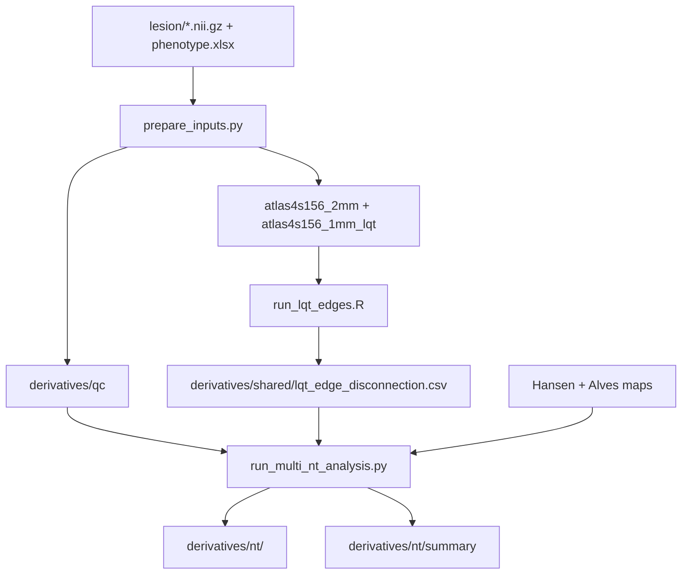

# Manual QC Guide

This guide covers the clean 2mm lesion-only multi-neurotransmitter pipeline.

## 1. Run Order

```bash
cd /home/zhenzong2/analysis/neurotransmitter
source /home/zhenzong/anaconda3/etc/profile.d/conda.sh
conda activate NT_analysis

config_path=config/dat_config.yaml
python scripts/fetch_reference_data.py --config "${config_path}" --maps
python scripts/fetch_lqt_data.py --config "${config_path}"
python scripts/prepare_inputs.py --config "${config_path}"
Rscript scripts/install_lqt_r_deps.R --project-dir /home/zhenzong2/analysis/neurotransmitter
Rscript scripts/run_lqt_edges.R --config "${config_path}"
python scripts/run_multi_nt_analysis.py --config "${config_path}"
```

## 2. Code Flow



## 3. QC Tables

Check these first:

```text
derivatives/qc/subject_manifest.csv
derivatives/qc/lesion_qc.csv
derivatives/qc/phenotype_merge_qc.csv
```

Expected:

- `shape` is `91x109x91`.
- `voxel_volume_mm3` is close to `8`.
- `lesion_volume_ml` is nonzero.
- Clinical columns used in the model are present.

Useful command:

```bash
python - <<'PY'
import pandas as pd
root = "/home/zhenzong2/analysis/neurotransmitter"
manifest = pd.read_csv(f"{root}/derivatives/qc/subject_manifest.csv")
print(manifest.shape)
print(manifest[["mrs_3m", "age", "sex", "nihss", "lesion_volume_ml"]].describe())
print(manifest.sort_values("lesion_volume_ml").head())
print(manifest.sort_values("lesion_volume_ml", ascending=False).head())
PY
```

## 4. Image QC

Open several lesions with the 2mm atlas:

```bash
fsleyes lesion/sub-TMS001ses01_space-MNI152NLin6Asym_res-02_label-lesion_mask.nii.gz \
  atlases/processed/atlas4s156_2mm.nii.gz
```

QC points:

- Lesion is inside the brain.
- No obvious left-right flip.
- Atlas and lesion occupy the same MNI152NLin6Asym 2mm grid.
- Do not judge orientation from raw array order alone; use the NIfTI affine.

## 5. Shared Edge QC

Main file:

```text
derivatives/shared/lqt_edge_disconnection.csv
```

Expected:

- One row per active subject.
- 12090 edge columns plus `subject_id` for 156 nodes.
- Many zeros are acceptable when lesions do not intersect atlas streamlines.

Useful command:

```bash
python - <<'PY'
import pandas as pd
edge = pd.read_csv("/home/zhenzong2/analysis/neurotransmitter/derivatives/shared/lqt_edge_disconnection.csv")
values = edge.drop(columns=["subject_id"])
print(edge.shape)
print((values != 0).sum(axis=1).describe())
print(values.to_numpy().sum())
PY
```

## 6. Multi-NT Result QC

Summary files:

```text
derivatives/nt/summary/nt_run_manifest.csv
derivatives/nt/summary/nt_run_report.md
derivatives/nt/summary/nt_prediction_performance.csv
derivatives/nt/summary/nt_prediction_vs_clinical_bootstrap.csv
```

Per-system folders:

```text
derivatives/nt/<nt_id>/atlases/
derivatives/nt/<nt_id>/node/
derivatives/nt/<nt_id>/edge/
derivatives/nt/<nt_id>/wm/
derivatives/nt/<nt_id>/impact/
derivatives/nt/<nt_id>/models/
```

Each configured `nt_id` should have:

- `node/nt_roi_156.csv`: Hansen gray-matter ROI mean.
- `node/nt_node_damage.csv`: lesion node load weighted by Hansen ROI value.
- `edge/nt_edge_lqt.csv`: LQT edge disconnection weighted by two endpoint ROI values.
- `wm/nt_wm_damage.csv`: lesion overlap summary on the Alves/Functionnectome WM map.
- `impact/nt_impact_scores.csv`: 10-fold out-of-fold lesion and NT impact scores.
- `models/model_prediction_performance.csv`: 10-fold out-of-sample prediction metrics.
- `models/model_prediction_pairwise_bootstrap.csv`: paired bootstrap model comparisons.

Useful command:

```bash
python - <<'PY'
from pathlib import Path
import pandas as pd
root = Path("/home/zhenzong2/analysis/neurotransmitter")
summary = root / "derivatives/nt/summary"
perf = pd.read_csv(summary / "nt_prediction_performance.csv")
boot = pd.read_csv(summary / "nt_prediction_vs_clinical_bootstrap.csv")
print(perf.groupby("nt_id")["model"].nunique())
print(perf[["nt_id", "model", "ordinal_log_loss", "ranked_probability_score", "ordinal_c_index", "binary_auc_mrs_le_threshold"]])
print(boot[["nt_id", "model_b", "metric", "delta_b_minus_a", "ci_low", "ci_high", "p_fdr_bh"]])
for nt_dir in sorted((root / "derivatives/nt").iterdir()):
    if not nt_dir.is_dir() or nt_dir.name == "summary":
        continue
    roi = pd.read_csv(nt_dir / "node/nt_roi_156.csv")
    node = pd.read_csv(nt_dir / "node/nt_node_damage.csv")
    edge = pd.read_csv(nt_dir / "edge/nt_edge_lqt.csv")
    impact = pd.read_csv(nt_dir / "impact/nt_impact_scores.csv")
    print(nt_dir.name, roi.shape, node.shape, edge.shape, impact.shape)
PY
```

## 7. Metric Reading

- `ordinal_log_loss`: lower is better.
- `ranked_probability_score`: lower is better.
- `ordinal_c_index`: higher is better.
- `binary_auc_mrs_le_threshold`: higher is better.

The primary comparison is `nt_model_prediction_performance.csv` plus
`nt_model_prediction_pairwise_bootstrap.csv`. Full-sample ordered-model fit
tables are secondary.
