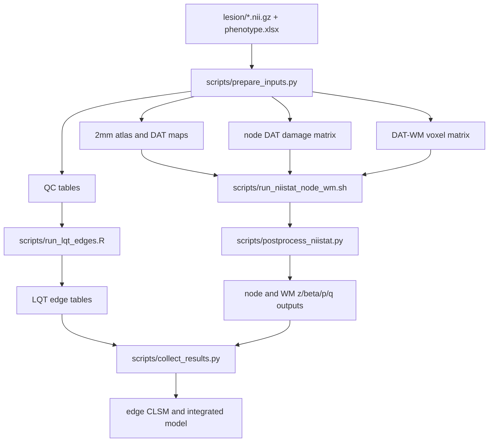

# Manual QC Guide

This guide describes how to manually QC the DAT NT-CLSM pilot outputs.
The current main pipeline uses the original MNI152NLin6Asym 2mm lesion masks as patient image input.

## 1. Code Flow



Run order:

```bash
cd /home/zhenzong2/analysis/neurotransmitter
source /home/zhenzong/anaconda3/etc/profile.d/conda.sh
conda activate NT_analysis

# First run notebooks/00_project_config.ipynb to write config/dat_config.yaml
config_path=config/dat_config.yaml
python scripts/prepare_inputs.py --config "${config_path}"
bash scripts/run_niistat_node_wm.sh --config "${config_path}"
python scripts/postprocess_niistat.py --config "${config_path}"
Rscript scripts/run_lqt_edges.R --config "${config_path}" --force
python scripts/collect_results.py --config "${config_path}"
```

## 2. First-Pass Table QC

Check these files first:

```text
derivatives/qc/subject_manifest.csv
derivatives/qc/lesion_qc.csv
derivatives/qc/phenotype_merge_qc.csv
```

Expected:

- `subject_manifest.csv` has one row per usable lesion mask.
- `lesion_qc.csv` has the same row count as `subject_manifest.csv`.
- `shape` should be `91x109x91`.
- `voxel_volume_mm3` should be close to `8`.
- `lesion_volume_ml` should not be zero.
- Missing clinical values should be expected and documented.

Useful command:

```bash
python - <<'PY'
import pandas as pd
root = "/home/zhenzong2/analysis/neurotransmitter"
manifest = pd.read_csv(f"{root}/derivatives/qc/subject_manifest.csv")
lesion = pd.read_csv(f"{root}/derivatives/qc/lesion_qc.csv")
print("subjects:", len(manifest))
print(manifest.filter(items=["mrs_3m", "age", "sex", "nihss"]).notna().sum())
print(lesion["lesion_volume_ml"].describe())
print(lesion.sort_values("lesion_volume_ml").head(5))
print(lesion.sort_values("lesion_volume_ml", ascending=False).head(5))
PY
```

Flag:

- Empty lesion.
- Implausibly large lesion.
- Non-2mm voxel volume.
- Mismatched subject IDs.

## 3. Image Space QC

Main lesion input:

```text
lesion/sub-*_space-MNI152NLin6Asym_res-02_label-lesion_mask.nii.gz
```

Open several lesions over an MNI anatomical template:

```bash
fsleyes external/lqt_data/MNI152_T1_1mm.nii.gz \
  lesion/sub-TMS001ses01_space-MNI152NLin6Asym_res-02_label-lesion_mask.nii.gz \
  atlases/processed/atlas4s156_2mm.nii.gz
```

QC points:

- Lesion overlays the brain, not outside skull.
- No left-right flip.
- Lesion sits in plausible vascular territory.
- Atlas overlay is in the same gross space.
- Viewer must respect NIfTI affine. Avoid judging orientation from raw voxel array alone.

## 4. Atlas And DAT Map QC

Check:

```text
atlases/processed/atlas4s156_2mm.nii.gz
atlases/processed/dat_gray_2mm.nii.gz
atlases/processed/dat_wm_2mm.nii.gz
atlases/processed/dat_wm_mask_2mm.nii.gz
atlases/lqt/atlas4s156_1mm.nii.gz
```

Expected:

- `atlas4s156_2mm.nii.gz` is discrete labels.
- `dat_gray_2mm.nii.gz` is continuous DAT gray-matter receptor/transporter density.
- `dat_wm_2mm.nii.gz` is continuous Functionnectome DAT-WM map.
- `dat_wm_mask_2mm.nii.gz` is binary and should be much smaller than the continuous nonzero background.
- `atlases/lqt/atlas4s156_1mm.nii.gz` is only for LQT/DSI connectivity output, not patient lesion input.

Useful command:

```bash
python - <<'PY'
from pathlib import Path
import nibabel as nib
import numpy as np
root = Path("/home/zhenzong2/analysis/neurotransmitter")
for rel in [
    "atlases/processed/atlas4s156_2mm.nii.gz",
    "atlases/processed/dat_gray_2mm.nii.gz",
    "atlases/processed/dat_wm_2mm.nii.gz",
    "atlases/processed/dat_wm_mask_2mm.nii.gz",
    "atlases/lqt/atlas4s156_1mm.nii.gz",
]:
    img = nib.load(root / rel)
    data = np.asanyarray(img.dataobj)
    print(rel, img.shape, img.header.get_zooms()[:3], "nonzero", int(np.count_nonzero(data)), "min", float(np.nanmin(data)), "max", float(np.nanmax(data)))
PY
```

Current expected DAT-WM mask scale:

```text
dat_wm_2mm nonzero voxels: many, due continuous interpolation background
dat_wm_mask_2mm nonzero voxels: about 156705
```

Flag:

- DAT-WM mask covers nearly the whole image.
- Mask is not binary.
- Atlas labels look shifted from lesion space.

## 5. Node-Level QC

Main files:

```text
derivatives/node_clsm/dat_roi_156.csv
derivatives/node_clsm/dat_node_damage.csv
derivatives/node_clsm/dat_node_clsm_stats.csv
derivatives/node_clsm/dat_node_clsm_beta_stats.csv
derivatives/node_clsm/dat_node_clsm_z_map.nii.gz
derivatives/node_clsm/dat_node_clsm_beta_map.nii.gz
```

Feature definition:

```text
node_dat_damage[i,r] = lesion_fraction_in_roi[i,r] * dat_mean_in_roi[r]
```

QC points:

- `dat_roi_156.csv` has 156 rows.
- `dat_node_damage.csv` has one row per subject and 157 columns including `subject_id`.
- Subjects with larger lesions should usually have more nonzero node features.
- `z_map` and `beta_map` should not be identical.
- `z_map` is the NiiStat standardized statistic.
- `beta_map` is true OLS beta from the same feature and covariate design.

Useful command:

```bash
python - <<'PY'
from pathlib import Path
import nibabel as nib
import numpy as np
import pandas as pd
root = Path("/home/zhenzong2/analysis/neurotransmitter")
roi = pd.read_csv(root / "derivatives/node_clsm/dat_roi_156.csv")
damage = pd.read_csv(root / "derivatives/node_clsm/dat_node_damage.csv")
stats = pd.read_csv(root / "derivatives/node_clsm/dat_node_clsm_stats.csv")
z = np.asanyarray(nib.load(root / "derivatives/node_clsm/dat_node_clsm_z_map.nii.gz").dataobj)
beta = np.asanyarray(nib.load(root / "derivatives/node_clsm/dat_node_clsm_beta_map.nii.gz").dataobj)
print("roi shape:", roi.shape)
print("damage shape:", damage.shape)
print("stats shape:", stats.shape)
print("nonzero node features per subject:")
print((damage.drop(columns=["subject_id"]) != 0).sum(axis=1).describe())
print("z range:", np.nanmin(z), np.nanmax(z))
print("beta range:", np.nanmin(beta), np.nanmax(beta))
print("z equals beta:", np.allclose(z, beta, equal_nan=True))
print(stats.sort_values("p").head(10))
PY
```

Flag:

- All node features are zero.
- DAT ROI coverage is unexpectedly low.
- `z_map` equals `beta_map`.
- Top findings are driven by one or two subjects with extreme lesion volume.

## 6. NiiStat Sum Map QC

Raw NiiStat outputs:

```text
derivatives/node_clsm/niistat_node_results/Zdat_node_clsm_mrs_3m.nii
derivatives/node_clsm/niistat_node_results/dat_node_clsmsum.nii
derivatives/wm_voxel_clsm/niistat_wm_results/Zdat_wm_voxel_clsmmrs_3m.nii
derivatives/wm_voxel_clsm/niistat_wm_results/dat_wm_voxel_clsmsum.nii
```

Interpretation:

- `Z*.nii` is the statistical Z image.
- `*clsmsum.nii` is an input exposure or coverage image.
- For node analysis, `dat_node_clsmsum.nii` is the cumulative DAT-weighted node-damage input per ROI.
- For voxel analysis, `dat_wm_voxel_clsmsum.nii` is the number of lesion overlaps per voxel within the DAT-WM mask.

Do not interpret `*clsmsum.nii` as significance or effect size.

QC points:

- Sum map should be nonzero in regions actually sampled by lesions.
- Very low sum means poor coverage and unstable statistics.
- Statistical interpretation should use Z/p/q/beta outputs, not sum map.

## 7. DAT-WM Voxelwise QC

Main files:

```text
derivatives/wm_voxel_clsm/dat_wm_voxel_z.nii.gz
derivatives/wm_voxel_clsm/dat_wm_voxel_beta.nii.gz
derivatives/wm_voxel_clsm/dat_wm_voxel_p.nii.gz
derivatives/wm_voxel_clsm/dat_wm_voxel_q.nii.gz
atlases/processed/dat_wm_mask_2mm.nii.gz
```

Interpretation:

- `z`: NiiStat standardized statistic.
- `beta`: true voxelwise OLS regression coefficient.
- `p`: uncorrected two-tailed p map from Z.
- `q`: FDR-corrected q map.
- `q_map` is the corrected significance map.

Useful command:

```bash
python - <<'PY'
from pathlib import Path
import nibabel as nib
import numpy as np
root = Path("/home/zhenzong2/analysis/neurotransmitter")
mask = np.asanyarray(nib.load(root / "atlases/processed/dat_wm_mask_2mm.nii.gz").dataobj) != 0
for rel in [
    "derivatives/wm_voxel_clsm/dat_wm_voxel_z.nii.gz",
    "derivatives/wm_voxel_clsm/dat_wm_voxel_beta.nii.gz",
    "derivatives/wm_voxel_clsm/dat_wm_voxel_p.nii.gz",
    "derivatives/wm_voxel_clsm/dat_wm_voxel_q.nii.gz",
]:
    data = np.asanyarray(nib.load(root / rel).dataobj)
    print(rel, "nonzero", int(np.count_nonzero(data)), "min in mask", float(np.nanmin(data[mask])), "max in mask", float(np.nanmax(data[mask])))
q = np.asanyarray(nib.load(root / "derivatives/wm_voxel_clsm/dat_wm_voxel_q.nii.gz").dataobj)
print("q < 0.05 in mask:", int((q[mask] < 0.05).sum()))
PY
```

Flag:

- `z_map` and `beta_map` are identical.
- `q_map` has significant voxels outside the DAT-WM mask.
- Mask includes large non-brain background.

## 8. LQT Edge QC

Current main LQT directory:

```text
derivatives/edge_clsm/lqt_2mm/
```

Main output files:

```text
derivatives/edge_clsm/lqt_edge_disconnection.csv
derivatives/edge_clsm/dat_edge_lqt.csv
derivatives/edge_clsm/dat_edge_clsm_stats_lqt.csv
derivatives/edge_clsm/dat_edge_beta_matrix_lqt.csv
derivatives/edge_clsm/dat_edge_p_matrix_lqt.csv
derivatives/edge_clsm/dat_edge_q_matrix_lqt.csv
```

Important:

- `*.dsi.mni.nii.gz` inside `lqt_2mm/<subject>/` is a symlink.
- Its small file size is normal.
- The symlink points to the original 2mm MNI lesion.
- The `.mni.` string is required so DSI Studio treats the lesion as MNI space.

Check one subject:

```bash
ls -l derivatives/edge_clsm/lqt_2mm/TMS001/*dsi.mni.nii.gz
readlink -f derivatives/edge_clsm/lqt_2mm/TMS001/*dsi.mni.nii.gz
grep -a "mni space\\|remaining tract count" derivatives/edge_clsm/lqt_2mm/TMS001/dsi_studio.log
```

Expected log line:

```text
size: 91 109 91 vs: 2 2 2 mni space
```

Generate an LQT log QC table:

```bash
python - <<'PY'
from pathlib import Path
import re
import pandas as pd
import numpy as np
root = Path("/home/zhenzong2/analysis/neurotransmitter")
lqt = root / "derivatives/edge_clsm/lqt_2mm"
ansi = re.compile(r"\\x1b\\[[0-9;]*m")
rows = []
for log in sorted(lqt.glob("TMS*/dsi_studio.log")):
    txt = ansi.sub("", log.read_text(errors="ignore"))
    match = re.search(r"remaining tract count\\s*:\\s*([0-9]+)", txt)
    count = int(match.group(1)) if match else None
    sid = log.parent.name
    mat = log.parent / f"{sid}_lqt_sdc_matrix.csv"
    nonzero = None
    total = None
    if mat.exists():
        arr = pd.read_csv(mat).to_numpy()
        nonzero = int(np.count_nonzero(arr))
        total = float(np.nansum(arr))
    rows.append({"subject_id": sid, "remaining_tracts": count, "nonzero_matrix_cells": nonzero, "sdc_sum": total})
df = pd.DataFrame(rows)
out = root / "derivatives/edge_clsm/lqt_2mm_qc_from_logs.csv"
df.to_csv(out, index=False)
print(df.describe().to_string())
print("written:", out)
PY
```

QC points:

- `dat_edge_lqt.csv` should have one row per subject and 12091 columns for 156 ROI nodes.
- Many zeros are expected if lesions are small or do not intersect HCP842 streamlines.
- A subject with nonzero `remaining_tracts` should usually have nonzero matrix cells.
- If all subjects have zero `remaining_tracts`, check lesion space and DSI `.mni.` handling first.

## 9. Integrated Model QC

Main files:

```text
derivatives/models/integrated_model_performance.csv
derivatives/models/selected_nodes.csv
derivatives/models/selected_edges.csv
derivatives/models/dat_integrated_score.csv
```

Current pilot interpretation:

- This is a smoke-test model.
- With small pilots and high-dimensional edge features, elastic-net convergence warnings can occur.
- Do not treat this as a clinical prediction result.

QC points:

- `n` should match cases with available `mRS_3m`.
- Selected features may be empty in a small pilot.
- If a smoke test with `--limit` was run, rerun full LQT before trusting the model.

## 10. Recommended Manual QC Order

1. Check `subject_manifest.csv`, `lesion_qc.csv`, and `phenotype_merge_qc.csv`.
2. Open 10 representative lesions over MNI anatomy.
3. Open `atlas4s156_2mm`, `dat_gray_2mm`, `dat_wm_2mm`, and `dat_wm_mask_2mm`.
4. Check `dat_roi_156.csv` and `dat_node_damage.csv`.
5. Open node `z_map` and `beta_map`; confirm they differ.
6. Open WM `z/beta/p/q` maps; use `q_map` for corrected significance.
7. Inspect LQT symlinks and DSI logs in `lqt_2mm`.
8. Check edge table dimensions and log-derived `remaining_tracts`.
9. Only after image and edge QC, inspect integrated model output.
